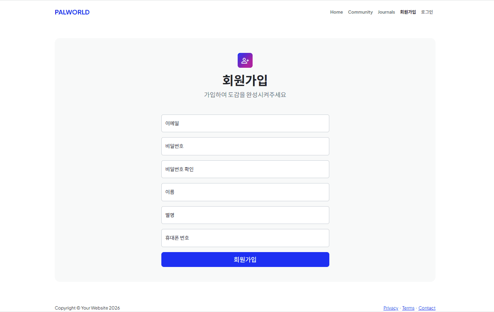
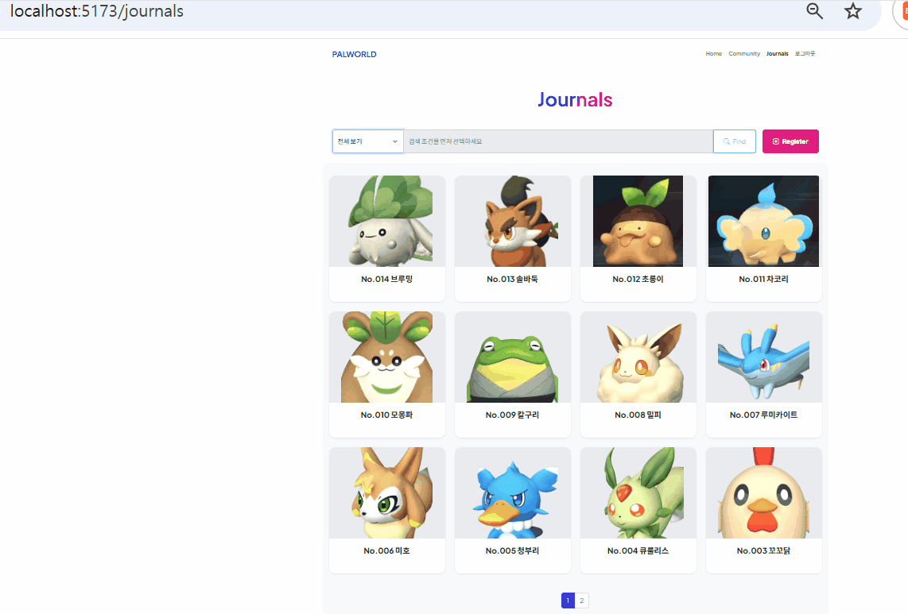

# GIF_STORAGE
GIF for My Projects

## 리액트_UI_구현
### 1. 유효성검사

▶ [유효성검사 크게보기](리액트_UI_구현/리액트UI구현_유효성검사.gif)

### 2. 검색

▶ [검색 크게보기](리액트_UI_구현/리액트UI구현_검색.gif)

### 3. 등록

▶ [등록 크게보기](리액트_UI_구현/리액트UI구현_등록.gif)

### 4. 수정 및 삭제

▶ [수정 및 삭제 크게보기](리액트_UI_구현/리액트UI구현_수정및삭제.gif)
